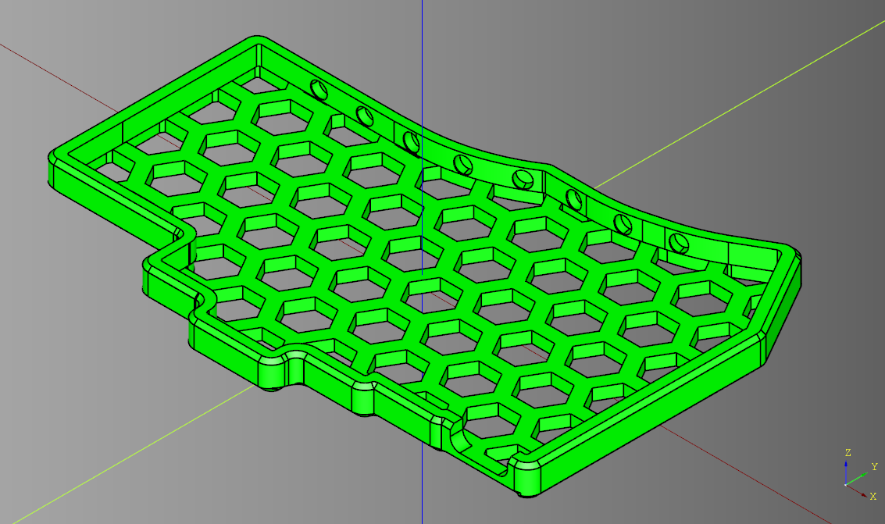
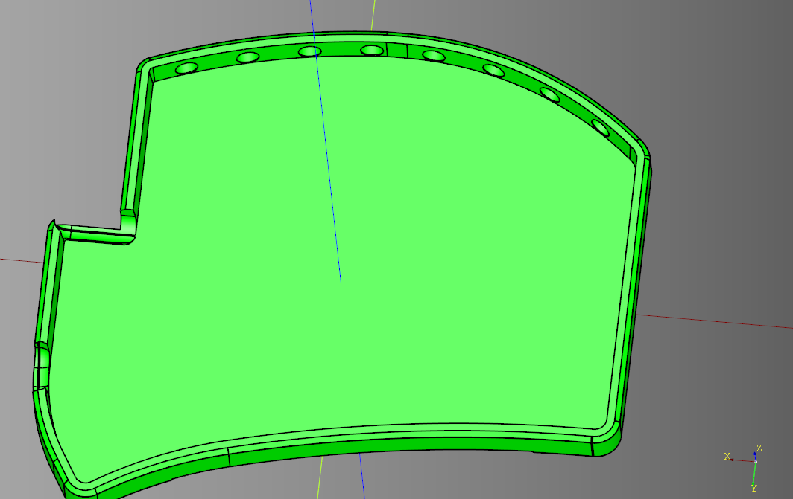
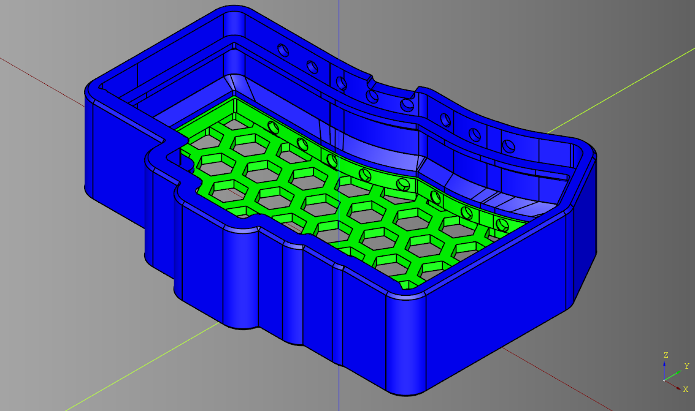
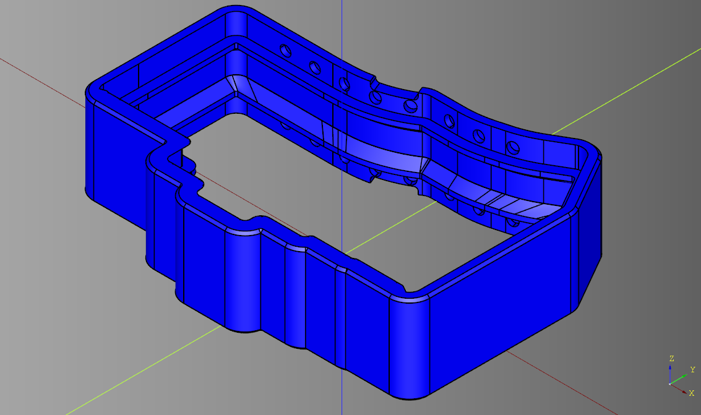
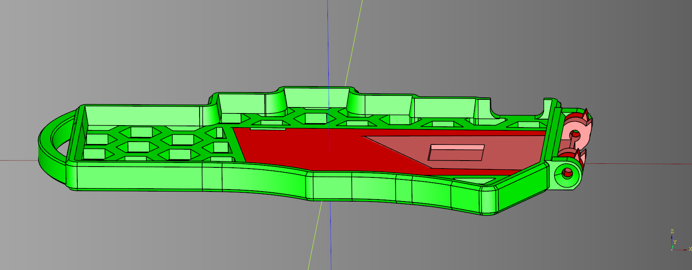
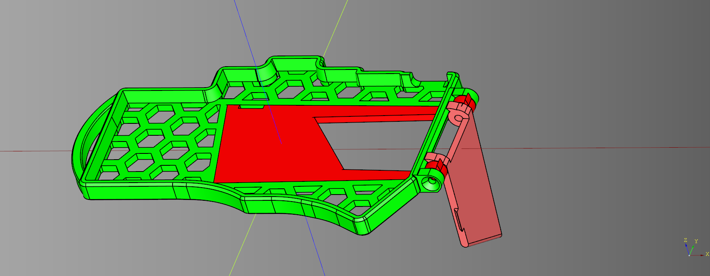

# Keyboard Snakeskin

Automatically generate a 3D printable case and magnetic carrycase for your custom split keyboard PCBs, from just the
outline. Also generates cases for other PCBs.

This case design generally uses a friction fit to get the PCB to stay in the
case. You can use hot glue instead if your printer tolerances are bad or
you want a sturdier/more permanent fit.
Cases have a removal cutout in one part of the wall for you to pull the case out
after pushing it in.

Inspired by and in collaboration with the [Compression keyboard](https://github.com/compressionKeyboards/compression4c) by Bennett Hermanoff. ([More images here](https://compressionkeyboards.com/)).

|  | |
| ------------- | -------------- |
|  *Example case rendered from the [maizeless](https://github.com/BlueDrink9/maizeless) PCB, with honeycomb base.* |  *Example [ferris](https://github.com/pierrechevalier83/ferris) case* |
| *Carrycase with one case inside*. The carrycase is mirrored around the center, to allow for two halves of a split board to be carried together.  | Just the carrycase  |
| With tenting legs and strap loop  | One leg open  |


## Features

* Gives you a protective case for your keyboard PCBs, even if you aren't using
a popular design.
* Compact magnetic carrycase gives you ultimate portability, quick to unclip
and start typing (no faffing with bags or zips).
* Quick-tenting mechanism with quick-unfold leg(s), customisable for multiple angles and heights.
* Optional honeycomb base, to look great, save on weight and plastic, and show
off your custom PCB and top-notch (😉) soldering.
* Loop for strap attachment
    * Attach the boards to your legs for a standing setup,
    * Tie to a chair arm for a more ergonomic sitting setup,
    * use as a handle or tie to your bag.
* Works with both split and non-split board PCBs
* Works with any PCB of unusual shape, even non-keyboard PCBs for whatever random project you want an enclosure for.

### Future feature ideas

* Unibody case generator, with customisable distances and angles. Possibly even
a temporary one (sit/clip your regular case into it to make it a unibody board
for the couch, then lift them up and use them separately at your desk).
* Integrate features with the carrycase. Possibly allow clipping the board
edges into the carrycase for a unibody angle, or clip the board onto the top as
a tenting mechanism.
* Strap loop on carrycase as a handle or to attach to a bag.
* Wrist wrest that magnetically snap to the case.
* Folding hinge join between the two halves, similar to the [Leaf fold](https://www.reddit.com/r/ErgoMechKeyboards/comments/1g9hv4a/introducing_leaf_fold_an_ultra_portable_keyboard/)
* Insets/holes under case to sit rubber feet in. (You can still use them currently, but they stick out of the bottom and may not be as stable.) This feature would probably be configured with a list of angles to place the holes at around the case edge (as well as hole diameter and depth, and maybe distance from the case edge). Subtracting holes from the final case would be quite easy to do manually from the .step output, so if you need this feature, you can probably do it yourself.
* Standoffs to screw in PCB --- I'm not likely to do this (at least certainly not automatically generating them from the PCB holes). This would be easy to add yourself from the .step output in another program like freecad, if you really need these.

> See anything you like? Open an issue and express interest

**Tip**: Take note of the version of snakeskin you use to build your cases, as
well as your current config.
You may want to print new parts as features are released, and you'll want the
same config and major version to ensure the case is compatible.
Features may also get added that change case designs, and you'll want to know
that if you want to reprint parts that you already have.

## Usage

Overall:
1. In KiCad, export **just the edge cuts layer** as an SVG.
2. Customise the design parameters for your board, either by creating/modifying a config json, or passing arguments. At minimum I would suggest tweaking the cutout and magnet positioning for your board, although I suggest verifying the program runs without errors on your SVG with defaults before tweaking too many parameters.
3. Run `snakeskin.py --config path/to/config.json path/to/edge_cuts.svg`.
4. (Optional) Read the [Configuration](#configuration) section to tweak for your board.

Note: this is still a young project, so please feel free to open issues. Include the SVG and config you are having issues with.

### Install

`pip install --user keeb-snakeskin` installs this package and dependencies, and
should create a new executable `snakeskin` in your python scripts folder.

Use `pip install --user git+https://github.com/BlueDrink9/keeb_snakeskin.git` for the latest git version.

### Input File

The program requires an SVG outline of the PCB, which is then used as the base shape for the case.
You can pass in either a:
* `.svg` file
* `kicad_pcb` file (if `kicad-cli` is available (on your `$PATH`))

For example:
```bash
snakeskin -o maizeless ~/src/maizeless/pcb/build/maizeless.gm1 --split true
```

The `-o` option specifies the output directory for your case files. If it is
not an absolute path, it will be created as a subfolder or file within the
`build` folder.

In this case the output would be `./build/maizeless/case.step` and `./build/maizeless/case_mirrored.stl`

See the [Configuration](#configuration) section for more information on how to customise the case design.

#### Getting the starting svg

Clean and working outline svgs for some boards are already included in the `./preset_outlines/` folder.
Currently this includes:
* [ferris (0.1)](https://github.com/pierrechevalier83/ferris)
* [maizeless](https://github.com/BlueDrink9/maizeless)
* [corne](https://github.com/foostan/crkbd) (cherry version, not sure what compatibility is like with other versions - it depends purely on the PCB outline)
* [Sofle](https://github.com/josefadamcik/SofleKeyboard) (v1 --- v2 works directly from the `.kicad_pcb`)

In kicad, export just the edge.cuts layer as plot format `svg` (board only, not page).
Note that KiCad has two ways to do this - plotting fabrication as an SVG, and exporting just edge as an SVG directly. The latter gives a more stable output.
Ensure coordinate output is mm if relevant, and all the 'plot' general options are unchecked.

You can do this with the cli via
`kicad-cli pcb export svg  --exclude-drawing-sheet --drill-shape-opt 1 --layers Edge.Cuts --output build/outline.svg ~/src/maizeless/pcb/maizeless.kicad_pcb`.
If you have kicad-cli on your `$PATH`, you can directly pass the `.kicad_pcb`
file to `snakeskin.py` and this export will be done for you.

If you only have a [keyboard-layout-editor](https://keyboard-layout-editor.com/) file, you can
generate an input SVG or KiCad PCB first with tools like
* https://github.com/fcoury/kbpcb
* https://kb.xyz.is/
* https://github.com/adamws/keyboard-tools

#### Troublesome PCBs/input files

This program requires the PCB outline to be a single, closed path. Complicated
PCBs will not work out of the box, for example ones with:

* large irregular holes (e.g. LED holes; vias and holes for keyboard switches are fine)
* internal cutouts (like for mid-mount connectors),
* breakable/mouse nibble columns,
* multiple halves
* multiple halves in a PCB frame

That being said, you can still use this program; you'll just need to manually
edit the SVG outline. Usually this will be as simple as removing the second
half or any internal holes. If you do this for a popular board, please open a PR to
share the resulting SVG (and ideally config json) in `./preset_outlines/`

**Note**: SVG outlines must not contain borders or technical drawings, as are
often exported by default in KiCad. Remove these if you are using an SVG input.

##### Troubleshooting steps to try
* First check with default settings
* Remove any internal holes or cutouts from the SVG
* Set `tiny_edge_rounding` to `True` in your config
* In Inkscape, select the outline, then `Path -> Stroke to Path`, then `Path -> Union`
* In Inkscape, select the outline, then `Path -> Simplify`
* In Inkscape, edit path nodes and ensure they are all connected (small
disconnections should be handled by the code, but large ones, especially in PCBs with bezier edges, may cause issues). To connect them, go to node edit mode, and draw a box around each node and each close pairs of nodes (drawing a box is important, don't just click) to select them both, then double-click `Join selected nodes` in the node editing toolbar.
* Note that KiCad usually exports a double layer for the edge cuts, so you may
  need to delete one before simplifying.

### Printing

Designed for PLA, but I've had suggestions that TPU will create a great softer,
more skinlike case. If you have access to it, I would suggest trying that - at
least for the inner case, if not the legs and carrycase.

#### Supports
These designs are designed to be printed in PLA without supports where possible. There
is only two severe (90 degree) overhang in the design, which is the first
blocker of the carrycase and the first carrycase finger cutout.
These should be the only parts that needs supports with the default featureset.
Setting your printer to only print overhangs over 70 degrees should be enough
to automatically support only these parts.

If you aren't printing the carrycase, you shouldn't need supports at all.
If you are using advanced features like the strap loop, you may need additional supports.
If `flush_carrycase_lip` is `False`, you will need short supports all around the bottom of the
carrycase, and its top lip. Again, setting overhangs to 70 degrees should
allocate supports appropriately.


### Assembly

For the basic case, just insert the PCB with a bit of force to get the friction
fit. You may choose to add hot clue underneath for a more permanent fit.

#### Carrycase

The only additional assembly required is inserting magnets. Check out [the Compression
video](https://www.youtube.com/watch?v=eRLCBHWX4eQ&t=905s) to get the general idea.
Only the carrycase magnets should need glue, the case magnets should be held in
by the PCB.

The magnets can be tricky to insert, because you need the orientation lined up between the case and carrycase, and if adjacent magnets are close together, they will interfere with the alignment during placement.
The easiest way to insert the magnets is to do the carrycase first, gluing the magnets that are far away from each other first, letting them dry, then doing the magnet locations adjacent to them.
Then, insert the cases into the carrycase one at a time and insert the magnets, letting the glued carrycase magnets orient the case magnets for you.

#### Tenting legs
1. Align the leg hinges with the case hinges (there should only be one sensible way they fit) and insert the nut.
Screw the bolt in.
2. Add a small piece of velcro to the top of the smallest leg. Add the other
   piece, then press the leg up into the case. Ideally the second piece should then glue to the
PCB. The velcro holds it in place. Feel free to come up with other mechanisms
for keeping it in place, but velcro is an easy solution that doesn't require
much force to remove. I got my velcro from an old bike helmet.

### Configuration

Other than the case design parameters below, you can also input the following
arguments:
- `-o`, `--output`: Output directory or file path (default: "build")
- `-c`, `--config`: Path to the JSON configuration file

The following tables describe the possible variables you can specify for
your case creation.
To modify the paramters, pass a path to a `.json` file with
`-c path/to/cfg.json`, and/or pass individual parameters as command line arguments.
See `python snakeskin.py --help` for more information and for defaults.
The json should have anything you want to override from
defaults specified as a top level key:value. See `./preset_configs/` for
examples.
Using both the json and command line argument for a parameter will take the
command line argument as priority.

You may prefer to modify an existing config, from `./preset_configs/`.
Currently there are configs for:
* [ferris](https://github.com/pierrechevalier83/ferris)
* [maizeless](https://github.com/BlueDrink9/maizeless)
* [corne](https://github.com/foostan/crkbd) (cherry version, although it may not have enough height in the carrycase for cherry keycaps - measure and tweak yourself!)
* [Sofle (v1 and v2)](https://github.com/josefadamcik/SofleKeyboard)
* [Lily58](https://github.com/kata0510/Lily58)

Please note that these configs are on a best-effort basis only, and so far only
the Maizeless has been tested on a real print.

| Parameter name | Example value + unit| Description |
| -------------- | ------------- | ----------- |
| `split`| True | If True, generate mirrored pair of files for a split board |
| `carrycase` | True | Whether the output designs should incorporate the compression-style carrycase. Will affect the main case as well. |
| `honeycomb_base` | True | Make the base of the case a honeycombed/hexagon cage instead of solid |
| `flush_carrycase_lip` | True | Two options for holding the pcb case into the carrycase: a lip that extends into the carrycase center, with a matching cutout in the pcb case; or, a lip that sits a bit above and below the carrycase. If false, the pcb case will have a flat bottom and your tolerances between the case and carrycase can be tighter, giving a better fit when in the case. However, it will require more supports when printing. |
| `strap_loop` | False | Adds a loop on the left most end of the boards for a strap, e.g. for mounting on legs or chair arms. Experimental. If you want something on the other side, also include the tenting flap hinge and use the bolt. |
| `tenting_stand` | False | Use the special quick-deploy tenting mechanism. This parameter adds the hinge to the case (and a gap for it in the carrycase) and exports the requested tenting flaps to the output directory. This creates a hinge at the end of the case, which is designed for a hex nut and countersunk bolt of customisable length. |
| `output_filetype` | `.step` | `.step` or `.stl`. What filetype the case will be exported as. |
| `tiny_edge_rounding` | False | Try enabling this if your case is erroring out with an OCP error, or other invalid shape error. Small hack to work around engine bugs when your outline has tiny edges that may cause problems during offset or extrude operations. May also make things worse, and will very slightly round off internal corners (which shouldn't prevent the PCB from fitting) |
| `simplify_beziers` | False | Try enabling this if your case is erroring out with an OCP error, or other invalid shape error. In some PCB outlines where rounded edges are defined using beziers (e.g. the corne), the 3D engine fails at offsetting or tapering the edges. This option converts beziers to straight line approximations. The approximation is crude, so you may get more accurate results if you do this yourself in inkscape with Extensions > modify path > Approximate curves by straight lines. This setting will probably cut corners a little, making the fit of the case around the PCB a bit tighter. Either increase the tolerance (if you have a lot of corners) or just carve out any tight bits after printing. |
| `base_z_thickness` | 3 mm | Z thickness of bottom of the case, in mm |
| `wall_xy_thickness` | 3 mm | Thickness/width in X and Y of the wall around the edge of the PCB, holding it in the case.  Top and bottom wall tolerance will also affect the thickness that actually gets printed. Recommend 2 + `magnet_separation_distance` if you're using the carrycase, so the magnets don't rattle. If it's larger, you'll have to glue the magnets into the case as well as the carrycase. If you are using the carrycase and have tall keys (i.e. not flat-soldered chocs) close to the edge of the PCB, you may need to make this bigger and tweak the carrycase lip to ensure enough clearance of the carrycase blocker when you insert the board. |
| `wall_z_height` | 4.0 mm | Z height of the wall **from the bottom of the PCB** (total case wall height will include z_space_under_pcb). The default includes room for magnets for the carrycase. If you aren't adding a carrycase, 1.6 is a good height for a standard PCB thickness if you just want to cover the pcb. |
| `z_space_under_pcb` | 1 mm | The size of the gap beneath the PCB, to leave room for through-hole pins, wires, hotswap sockets etc on the underside. Modify this to at least 1.85 if you are using kailh hotswap sockets under the PCB, for example. Also increase it if you want to have bigger tolerences for the fit and need more space for the walls to narrow in. By default, leaves just enough space for the pins of a choc switch directly soldered into a 1.6 mm pcb (which I measure stick out at about 0.83 mm). |
| `wall_xy_bottom_tolerance` | -0.3 mm | Amount of space between the PCB and the case walls near the case bottom, where PCB should sit (i.e. above z_space_under_pcb). Intended as a -ve value to get a tight friction fit. This is implemented with a scaling hack because of engine limitations, so I'd encourage measuring the result in a CAD program if you need it exact. |
| `wall_xy_top_tolerance` | 0.3 mm | Amount of space between the widest part of the walls (at the top) and the PCB outline. Adjust this depending on printer tolerances and how tight you want the friction fit. You may want to increase `z_space_under_pcb` if the difference between this and `wall_xy_bottom_tolerance` is large |
| `cutout_position` | 10 | Location along the walls of the pcb case for a cutout to remove the PCB from the board, as an angle from the center of the case. Angle is between -180 and 180, with 0 pointing in +ve X axis, and -90 pointing in the -ve Y axis. Not every angle is possible, so your argument will be mapped to the closest acceptable angle. I suggest this position also be the location of your USB connector. |
| `cutout_width` | 15 mm | Width of the removal cutout. May cut out more if the area isn't a straight line. |
| `additional_cutouts` | `[[10, 15]]` | List of extra cutouts in the wall to add, in the format `[[angle at center of cutout, width],]`. See `cutout_position` for info about the angles. Use this to place an extra cutout for your TRRS cable, if it's a wired board. |
| `honeycomb_radius` | 6 mm | Radius of the blank space hexagons for the honeycomb case base (major/inscribed radius) |
| `honeycomb_thickness` | 2 mm | Thickness of the bars (space between hexagons) of the honeycomb case base |
| `strap_loop_thickness` | 4 mm | Thickness (in XY) of the strap loop |
| `strap_loop_end_offset` | 0 mm | Inset from the ends of the case where the strap starts. Fiddle with this to avoid or merge with corners, for example. |
| `strap_loop_gap` | 5 mm | Gap left in the strap loop for the strap to go through. |
| `tent_legs` | `[[30, 50, 0], [20, 30, 15]]`, | List of tent legs as `width` (Y len), `length` (X len) and `tenting_angle` (slope of the tip), which will be exported as separate files, as well as cut out of the keyboard base. Multiple legs will be nested within each other (to the extent possible with the length of the hinge). Width is the width of the leg flap at the end furthest from the hinge. The tenting angle is the angle from 0 that the keyboard will be rotated clockwise when looking in the direction of the X axis (i.e. angle it will tilt the board face towards/away from the user). The end widths must decrease with length, or nesting will fail. |
| `tent_hinge_width` | 5 | How thick in the Y axis the hinges are that hold the tenting flaps. Keep this short if you have lots of tenting flaps, otherwise you may as well increase it to increase the strength. |
| `tent_hinge_bolt_d` | 3 (mm, == M3) | Bolt diameter specification for the tenting stand hinge. If you are using imperial bolts, be sure to convert the official size to mm, don't measure the thread. Keep this as small as you can, because the bigger the hole, the less plastic holding it in place. |
| `tent_hinge_bolt_l` | 60 mm | Length of bolt for the tenting stand hinge, including head assuming it's countersunk. I'd suggest getting something as big as you can find for the size of your case. Push rods might help getting something really long, with small diameters (but will need two nuts). |
| `tent_hinge_bolt_head_d` | 6.94 mm | Diameter of bolt head (only used for countersink). |
| `tent_hinge_nut_l` | 5.5 mm | Length of nut retention hole |
| `tent_hinge_nut_d` | 2.4 mm | Inscribed diameter of nut for tent hinge bolt |

#### Carrycase options

If you are creating a carrycase (`"carrycase": true`), the following additional parameters are available in the same configuration:

| Parameter name | default value | description |
| -------------- | ------------- | ----------- |
| `carrycase_tolerance_xy` | 0.8 mm | Gap size between the pcb case and the carry case. May need playing around with on your printer to get a good fit. Err on the side of too large if you don't want to print too much. |
| `carrycase_tolerance_z` | 0.5 mm | Gap size between the pcb case and the carry case blockers. May need playing around with on your printer to get a good fit. Larger carrycase tolerances will make it easier to get the case into and out of the carrycase, at the cost of tightness of fit once it's in there. |
| `carrycase_wall_xy_thickness` | 2 mm | Thickness of the carrycase outer wall |
| `carrycase_z_gap_between_cases` | 8 mm | How much room to leave between each pcb (well, actually between the tops of the pcb case walls). By default this works for soldered in choc v1 switches with thin keycaps (and it will leave about 1 mm between them when they are in the case |
| `carrycase_cutout_position` | -90 | Location  along the walls of the carrycase for the cutout that lets you remove the cases, as an angle from the center of the case. Should be opposite the lip, on the same side as the magnets. See `cutout_position` for info about the angles. |
| `carrycase_cutout_xy_width` | 15 mm | Width of the finger cutout for removing the boards from the case. May cut out more if the area isn't a straight line. |
| `lip_len` | 1.5 mm | Length of the lip (not including carrycase tolerance, i.e. this is the xy length that protrudes over the case). |
| `lip_position_angles` | [160, 30] | A list of two angles, [start_angle, end_angle], that defines the position of the lip on the case. Measured in degrees from the positive X-axis. Positive angles are measured counterclockwise, with 0 degrees being the positive X-axis and 90 degrees being the positive Y-axis, -90 is the direction of the negative Y axis.The difference between the start and end angles must be less than 180 degrees. It is recommended to set the angles to cover a long, straight section of the case. This must be opposite to the location of the finger cutout on the carry case and the magnets. |
| `magnet_position` | -90 | Location  along the walls of the carrycase and case where the magnets will be centered, as an angle from the center of the case. Angle is between -180 and 180, with 0 pointing in +ve X axis, and -90 pointing in the -ve Y axis. |
| `magnet_separation_distance` | 0.3 mm | Amount of plastic separating the magnets in the case from the magnets in the carrycase. How thick the case wall |
| `magnet_spacing` | 12 mm | Distance between the centers of magnets along the same wall of the case |
| `magnet_count` | 8 | Number of magnets per case (a split board and compression case will need 4× this amount to complete the build). |


## Development

Versioning will follow [semantic versioning](https://semver.org/) to an extent.
Features will be added in minor versions, and bugfixes in patch versions.
Designs will be considered "breaking" changes if a plain case printed with a
prior version would no longer fit the carrycase/other features added in a new
version. This does not apply to more advanced features.

## Final notes

This took a _lot_ of time and brainpower to work through. My sincerest hope is
that it is useful, and unlocks the ability to have cool, super-portable cases
for your keyboards. I want people to feel that they can create a keyboard that
fits their hands without forfeiting access to cool cases, rather than having to
go with a more popular form factor.

If you found it useful, indicating your appreciation will fill me with joy. A
star or a share are fantastic, letting me know someone has found this useful
(or even just cool). Even better, you might choose to donate a token of
appreciation, either via Github or crypto:
* bitcoincash:qp9c4ppt24c2ewzypv0pk0euapcyr92n85y7rhes7v
* monero: 48x8HBjE5zeHyk73wtkKdZUJLgBnRFQKWjTnawRFqu3Z5Ldd3CMEGWLE4v1UV1vqSAZCYJRWnDX97iJwxeDtkT9W489vYWr

I'd also like to encourage you to sponsor
[build123d](https://github.com/gumyr/build123d), the technology behind this
project. Their Discord was a great help in figuring out many of the
representational challenges.
